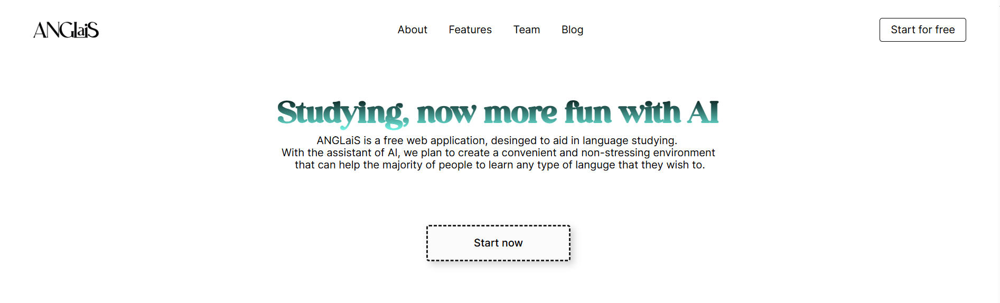

<h1 align="center">
  <br>
  </img>
  <br>
  Anglais
  <br>
</h1>

<h4 align="center">Một phần mềm học tiếng anh dựa trên công nghệ AI <a href="" target="_blank"></a>.</h4>


<p align="center">
  <a href="#key-features">Key Features</a> •
  <a href="#demo">Demo</a> •
  <a href="#how-to-use">How To Use</a> •
  <a href="#persona">Persona</a> •
  <a href="#credits">Credits</a> •
  <a href="#related">Related</a> •
</p>



## Key Features


* Học từ vựng thông qua flashcard : 
  - Bạn có thể thêm tùy ý từ vựng vào studyset với đa dạng lựa chọn ngôn ngữ 
* Trợ lý ảo hỗ trợ học tiếng anh
  - Cung cấp phản hồi và giải đáp
  - Hỗ trợ việc viết tiếng anh và sửa lỗi từ vựng , ngữ pháp
* Nâng cao khả năng speaking với Mastermind
  - Luyện nói tiếng anh với giọng đọc chuẩn người bản ngữ

## Demo 
- Link demo sản phẩm: [Anglais.com](https://anglais-nhom33.onrender.com)
- Link báo cáo chi tiết sản phẩm :[Notion]( https://sparkly-magazine-bbc.notion.site/B-o-c-o-b-i-t-p-l-n-c-ng-ngh-ph-n-m-m-59372d741b694b23a6866bb57d57665d?pvs=4)
- Video demo sản phẩm : [Video1](https://drive.google.com/file/d/1pCVs5XSKNgHtsFo_Z-ABNq9jVXfU3ECd/view?usp=sharing), [Video2](https://drive.google.com/file/d/1VLjAww3E9c3p_-jP5goQ7k0V0NmzRbjQ/view?usp=sharing)


## How To Use

Để clone và chạy ứng dụng này, bạn cần cài đặt [Git](https://git-scm.com) trong máy tính và thực hiện các lệnh sau: 

```bash
# Clone this repository
$ git clone https://github.com/trungviet17/Anglais

# Go into the repository
$ cd anglais

# Install dependencies
$ python -m venv final_project 

$ pip install -r requirements.txt

$ python manage.py runserver
# # Run the app
# $ npm start
```

## Persona
Hoa - sinh viên năm nhất ngành trí tuệ nhân tạo
- Personalization : Hoa là sinh viên năm nhất trường ĐHQGHN, 18 tuổi, cô ấy mới tốt nghiệp cấp 3 và có trình độ tiếng anh ở mức trung bình.
- Job-related : Hoa học ngành liên quan đến đọc nhiều tài liệu tiếng anh chuyên ngành, giao tiếp bằng tiếng anh nhiều.
- Relevance : Hoa quan tâm đến ứng dụng học tiếng Anh để cải thiện kỹ năng ngôn ngữ của mình. Cô ấy muốn có thể giao tiếp một cách tự tin hơn trong công việc và học tập và tăng cơ hội thăng tiến trong sự nghiệp.
- Education : Tốt nghiệp cấp 3 và có kiến thức cơ bản về công nghệ, thường xuyên sử dụng các ứng dụng văn phòng.

<!-- You can [download](https://github.com/amitmerchant1990/electron-markdownify/releases/tag/v1.2.0) the latest installable version of Markdownify for Windows, macOS and Linux. -->

## Credits

Phần mềm sử dụng các thư viện, framework sau: 


- [Django](https://www.djangoproject.com/)
- [Bootstrap](https://getbootstrap.com/)
- [OpenAI](https://openai.com/blog/openai-api)

## Contributor
- [Nguyễn Ngô Việt Trung](https://github.com/trungviet17/) - 22022598 : Xây dựng backend, database 
- [Vũ Minh Tiến](https://github.com/TienVM2004) -22022645 -  : Xây dựng hệ thống giao diện người dùng 
- [Phạm Quang Vinh](https://github.com/VinhPhamAI) - 22022648 -  : Xây dựng tính năng cho AI cho hệ thống 


## Related

> GitHub [@anglais](https://github.com/trungviet17/Anglais) &nbsp;&middot;&nbsp;

